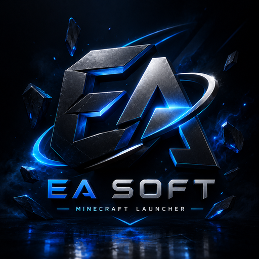

# EA Soft Minecraft Launcher

**A modern, fast desktop launcher for Minecraft: Java Edition.**
**Minecraft: Java Edition için modern ve hızlı bir masaüstü başlatıcısı.**

Built with Tauri, Rust, and TypeScript.

**[English](#english) · [Türkçe](#türkçe)**

---

## English

### About

EA Soft Minecraft Launcher is a desktop application that lets players manage and
launch their legally-owned copy of **Minecraft: Java Edition**. It focuses on a
clean interface, fast performance, and flexible account support.

The launcher is built on a lightweight native stack (Tauri + Rust core), so it
starts quickly and uses far less memory than typical Electron-based launchers.

### Features

- **Multiple sign-in options** — Microsoft (for accounts that own the game),
  ely.by, and offline mode.
- **Instance management** — create and manage separate Minecraft profiles, each
  with its own version, memory allocation, and Java runtime.
- **Automatic Java handling** — the launcher provisions the correct Java runtime
  for each Minecraft version, so users don't have to install Java manually.
- **Mod browsing & install** — search and install mods, modpacks, resource packs,
  and shaders from Modrinth.
- **Built-in themes & localization** — light/dark themes and multi-language UI.
- **Cloud sync & backups** — optional sync of instances and settings.

### Authentication

For Microsoft accounts, the launcher uses the standard Microsoft OAuth 2.0
**device-code flow** with the `XboxLive.signin` scope, followed by the documented
Xbox Live → XSTS → Minecraft services chain to obtain a Minecraft profile and
access token.

Credentials are **never stored or transmitted** anywhere except Microsoft's own
authentication endpoints. Only the resulting session tokens are kept locally on
the user's device so they don't have to sign in every time.

Players must own Minecraft: Java Edition (or use ely.by / offline mode). The
launcher does not enable playing the game without a valid license.

### Tech Stack

| Layer       | Technology                          |
|-------------|-------------------------------------|
| Desktop     | Tauri v2                            |
| Core        | Rust                                |
| Frontend    | TypeScript, Vite, TailwindCSS       |
| Mod data    | Modrinth API                        |

### Status

Active development. This is an independent personal project and is **not
affiliated with Mojang Studios or Microsoft**. Minecraft is a trademark of
Mojang Studios.

### Contact

If you have any questions about this application, you can open an issue in this repository or reach out to us via our Discord server:
https://discord.gg/AMZ8anwGx

---

## Türkçe

### Hakkında

EA Soft Minecraft Launcher, oyuncuların yasal olarak sahip oldukları
**Minecraft: Java Edition** kopyalarını yönetip başlatmalarını sağlayan bir
masaüstü uygulamasıdır. Temiz bir arayüz, yüksek performans ve esnek hesap
desteğine odaklanır.

Başlatıcı, hafif ve yerel bir altyapı (Tauri + Rust çekirdeği) üzerine
kuruludur; bu sayede hızlı açılır ve tipik Electron tabanlı başlatıcılara göre
çok daha az bellek kullanır.

### Özellikler

- **Çoklu giriş seçenekleri** — Microsoft (oyuna sahip hesaplar için),
  ely.by ve çevrimdışı mod.
- **Sürüm (instance) yönetimi** — her biri kendi sürümü, bellek ayarı ve Java
  çalışma zamanına sahip ayrı Minecraft profilleri oluşturup yönetme.
- **Otomatik Java yönetimi** — başlatıcı, her Minecraft sürümü için doğru Java
  çalışma zamanını otomatik kurar; kullanıcıların Java'yı elle kurması gerekmez.
- **Mod arama ve kurma** — Modrinth üzerinden mod, modpack, kaynak paketi ve
  shader arayıp kurma.
- **Yerleşik temalar ve dil desteği** — açık/koyu tema ve çok dilli arayüz.
- **Bulut eşitleme ve yedekleme** — sürümlerin ve ayarların isteğe bağlı
  eşitlenmesi.

### Kimlik Doğrulama

Microsoft hesapları için başlatıcı, `XboxLive.signin` kapsamıyla standart
Microsoft OAuth 2.0 **aygıt kodu (device-code) akışını** kullanır; ardından bir
Minecraft profili ve erişim belirteci almak için belgelenmiş
Xbox Live → XSTS → Minecraft servisleri zincirini izler.

Kimlik bilgileri (kullanıcı adı/şifre), Microsoft'un kendi kimlik doğrulama
uç noktaları dışında **hiçbir yerde saklanmaz veya iletilmez**. Yalnızca elde
edilen oturum belirteçleri, kullanıcının her seferinde tekrar giriş yapmasını
önlemek için yerel olarak cihazda tutulur.

Oyuncuların Minecraft: Java Edition'a sahip olması gerekir (veya ely.by /
çevrimdışı mod kullanılabilir). Başlatıcı, geçerli bir lisans olmadan oyunun
oynanmasını sağlamaz.

### Teknolojiler

| Katman      | Teknoloji                           |
|-------------|-------------------------------------|
| Masaüstü    | Tauri v2                            |
| Çekirdek    | Rust                                |
| Arayüz      | TypeScript, Vite, TailwindCSS       |
| Mod verisi  | Modrinth API                        |

### Durum

Aktif geliştirme aşamasında. Bu, bağımsız ve kişisel bir projedir ve
**Mojang Studios veya Microsoft ile bağlantılı değildir**. Minecraft, Mojang
Studios'un ticari markasıdır.

### İletişim

Bu uygulama hakkındaki sorularınız için bu depoda bir hata kaydı (issue) açabilir veya Discord sunucumuz üzerinden bizimle iletişime geçebilirsiniz:
https://discord.gg/AMZ8anwGx

---

EA Soft Minecraft Launcher — an independent launcher for Minecraft: Java Edition.

